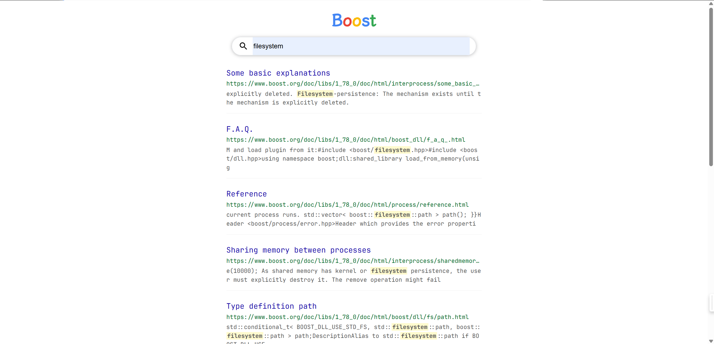

# 基于自主实现的高性能服务器实现C++扩展库Boost搜索引擎

## 简介

本项目是基于C++扩展库Boost的搜索引擎项目，主要目的是了解站内搜索基本原理。本项目在已有的[基础项目](https://github.com/H0308/BoostSearchingEngine)之上更改了后端服务器，并处理了可能的请求边界问题

## 资源准备

> 相对于原始Boost搜索引擎项目做了日志更改和服务器更改

1. 后端：C++、[仿Muduo的高性能服务器（服务端）](https://github.com/yhirose/cpp-httplib)、[Jieba分词](https://github.com/fxsjy/jieba)、[Jsoncpp](https://www.help-doc.top/%E5%85%B6%E5%AE%83/%E5%85%B3%E4%BA%8EJSONCPP%E5%BA%93/%E5%85%B3%E4%BA%8EJSONCPP%E5%BA%93.html#jsoncpp)
2. 前端：HTML、CSS和JavaScript
3. 搜索内容：[1.78版本的Boost库](https://archives.boost.io/release/1.78.0/source/)中的`doc/html`中的内容。也可以到[数据源链接](https://github.com/H0308/Boostv1.78)下载
4. 日志：由原来自主实现的日志系统转换为spdlog

> 当前项目仓库中不包含用于搜索的Boost库完整内容

## 使用

```shell
git clone https://github.com/H0308/BoostSearchingEngine_ReactorServer.git
cd BoostSearchingEngine_ReactorServer/boost_search/demo
# 先修改Makefile中有关资源路径的配置
make
./server 自定义端口号
```

> 运行之前需要先检查环境和依赖，对于软链接需要自行配置。需要注意，如果系统是CentOS，可能会因为gcc/g\+\+版本不足导致无法正常编译或者运行，请自行升级gcc/g\+\+

## 关于整合前的两个项目

1. [C++扩展库Boost搜索引擎项目（了解站内搜索基本原理）](https://github.com/H0308/BoostSearchingEngine)
2. [仿Muduo的高性能服务器（服务端）](https://github.com/H0308/ReactorServer)

## 运行示例

主页：


搜索：



404：


